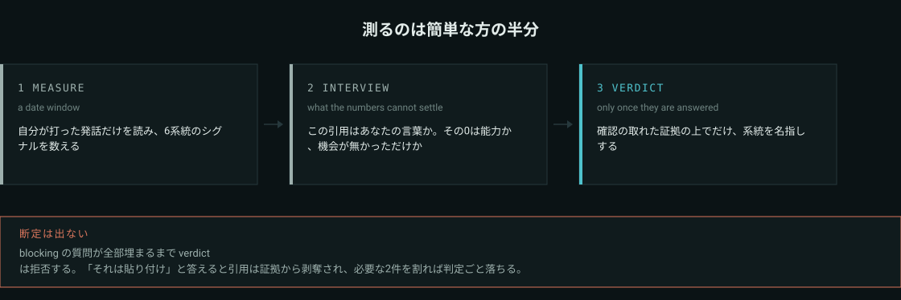
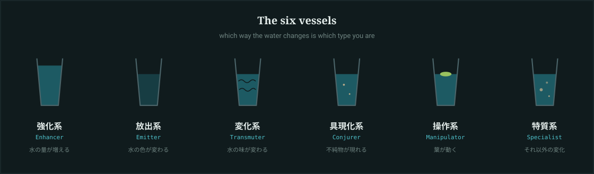
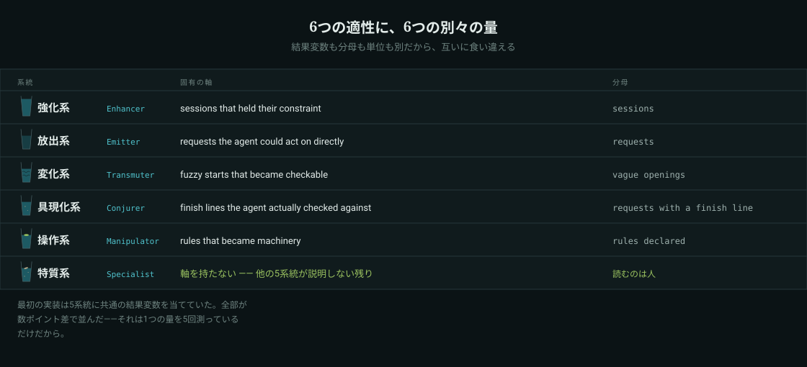

# agent-water-divination

[](https://github.com/kai-chop/agent-water-divination/actions/workflows/test.yml)

**AIの性能は毎日どこかで測られているのに、指示を書いている側は誰にも測られていない。**
けれど手元には、自分がAIをどう率いてきたかの記録が何ヶ月ぶんも残っている。
これはその記録を読み返して、あなたの指示が実際に示している系統を名指しする道具です。

> 🇬🇧 **English**: [README.md](README.md)

```
python tools/water_divination.py measure --since 2026-08-01
```

入口はこれだけ。トランスクリプトを見つけ、その期間に**自分が打った発話だけ**を残し、6系統の
シグナルを数える。そして——ここが本体ですが——**数値では決まらなかったことを質問として出す**。



## 6系統はどこから来ているか

水見式は、冨樫義博『HUNTER×HUNTER』に出てくる念能力の系統診断です。グラスに水を満たして木の葉を浮かべ、
手のオーラでグラスを包んで練を行うと、6通りのどれかの変化が起きて系統が分かる。ここではその6つを
そのまま借りて、**AIを率いる側の能力**として読み替えています。グラスにあたるのが、あなたの1ヶ月ぶんの発話です。

| 系統 | グラスの変化 | 読み替え |
|---|---|---|
| 強化系 | 水の量が増える | 目的と制約を最後まで維持する力 |
| 放出系 | 水の色が変わる | 頭の中の完成像をAIへ届ける力 |
| 変化系 | 水の味が変わる | 感覚や別分野の構造を、この文脈の形へ置き換える力 |
| 具現化系 | 不純物が現れる | 曖昧な理想を仕様と完成条件へ落とす力 |
| 操作系 | 葉が動く | 出力を直すだけでなく、AIの判断規則そのものを整える力 |
| 特質系 | 葉が枯れる・溶ける | 他の5系統では説明できない何か |

6つのうち5つは**水**に起きる変化で、特質系だけが**葉**に起きる。この非対称が、特質系だけ測り方を
変えている理由です（後述）。



本リポジトリは『HUNTER×HUNTER』の権利者と一切関係がなく、許諾も受けていません。
借りているのは6分類の枠組みだけで、公表された作品に対する一つの読みとして使っています。

## 測るのは簡単な方の半分

「今後は」を6回書いた、までは正規表現で分かる。分からないのは次の3つです。

- 900文字の発話が**自分の文章**なのか、他のAIの出力を貼ったものなのか
- シグナルが**0**なのは、できないからなのか、その月にその機会が無かっただけなのか
- 見つかった引用が、文脈の中でも同じ意味なのか

なので断定しません。`measure` は最後に**確認事項の一覧**を出し、`verdict` は
blocking の質問が未回答のあいだ**結論を拒否します**。

```
NO VERDICT. The reading stays provisional because:
  - blocking questions unanswered: auth_kyouka_20260820T1632
  - sousa has 1 quote(s) left after revocations, needs 2 or a passing probe
```

「いや、それは貼り付け」と答えるとその引用は**証拠から剥奪**され、その系統が必要な2件を割り込めば
判定ごと落ちます。対話は儀式ではなく門です。

## 6つの適性には、6つの別々の量が要る

語彙を数えても分かるのは「その適性を**使った**」ことまでで、「**効いた**」かは分からない。
だから各系統は2つ目の数字を持ちます——言った後に、AI側で何が起きたか。
**結果変数も分母も単位も系統ごとに別**なので、互いに独立して動きます。

| 系統 | 固有の軸 | 分母 | 比較対象 |
|---|---|---|---|
| 強化系 | 置いた制約のまま、訂正なしで完走したセッション | セッション | 制約を置かなかったセッション |
| 放出系 | AIが**補完せずに済んだ**依頼 | 完成像を描いた依頼 | 描かなかった依頼 |
| 変化系 | 曖昧な出だしが、他人にも判定できる形になった割合 | 曖昧な出だし | 曖昧に始まらなかったセッション |
| 具現化系 | 完了条件つき依頼のうち、AIが証拠を持って戻った割合 | 完了条件つき依頼 | 完了条件なしの依頼 |
| 操作系 | ルール・フック・設定へ書き込まれた宣言 | ルール宣言 | その他の依頼 |
| 特質系 | 率ではない（後述） | — | — |

**すべての軸に比較対象を並べます。これは飾りではありません。** 実コーパスで強化系は 95.0% と出ましたが、
比較側——制約を置かなかったセッション——も 90.2% で完走していました。実際の差は **+4.8pt** しかない。
一方で操作系は 66.7% 対 46.3%（**+20.4**）、具現化系は 75.0% 対 57.2%（**+17.8**）。
比較列が無ければ、**いちばん平坦な軸を主武器に推し、本当に効いている2つを埋めていた**ことになります。
基準線との差が3pt未満の軸は「**何も言っていない**」と明記されます。

放出系は同じ教訓の裏側です。以前は「AIが訊き返さなかった依頼」を数えて 97.0% でした——AIはそもそも
滅多に訊き返さないからです。訊き返しは**AIが穴を埋める3つの形のうち1つ**にすぎず、残る2つ
（**前提を宣言する**・**選択肢を差し戻す**）は頻繁に起きます。3つとも数えると天井が下がり、数字が動きます。



最初の実装は素直に「全系統に共通の結果変数を当て、どの語彙を含むかで母集団を割る」形にしました。
すると**5系統が数ポイント差で全部同じ向き**に出た。当然で、その設計は1つの量を5回測っているだけです
（長い依頼はどの語彙も多く含み、かつ難しい）。長さで補正すれば数字は整いますが、
それは構造の欠陥を統計で隠す行為です。**6軸が互いに食い違えないなら、それは6軸ではない。**

## 特質系は「残り」であって、道具は判定しない

6つのうち5つは水に、特質系だけは葉に起きる。検出器もスコアも置いていないのは同じ理由です——
定義が**他の5系統では説明できないもの**である以上、「珍しい形のリスト」を用意した時点で、
それは**誰かが発明したパターン**でしかない。5系統のシグナルが抱えている危うさを、一段上でやり直す
ことになります。

だから道具の仕事は1つだけ。**残差の切り出し**——5系統のどのシグナルも説明せず、しかもAIが実際に
作業した発話を取り出す。5系統がそもそもあなたの何%を説明できているかを出し、残りを
**自分のコーパスの中で言い回しがどれだけ珍しいか**で並べます。この並びは**読む順番**であって、
特別だという主張ではありません。

そのうえで読み手（あなた、または読みを進めるAI）が、**理由つきで**どちらかを言う。
**「他の5系統が説明していないものがここにある。それはこれだ」**か、
**「無い。残差の正体はこうだった」**か。作った元のコーパスでは、5系統が説明できたのは全体の約17%で、
残差には「**未指定の部分も過去の指示をもとに正解に導く**」のような指示が出てきました——
これは制約の保持でも、完了条件でも、規則化でも、見立てでもありません。

**「無い」が通常の結果**です。何を数えるかを先に決めた瞬間、それは残差ではなくなります。

## 作った元のコーパスで実際に出たこと

実データ1件、2026-07-27〜2026-09-01、Claude Code と Codex のトランスクリプト、抽出505件。
道具の形を決めたのは次の3つでした。

**505件の「ユーザー発話」のうち24件（4.8%）が、他AIの文章の貼り付けだった。**
件数比は小さいが影響は大きく——貼り付けた査読文は訂正語を大量に含むので、訂正の一発収束率が
込みで **26.9%（7/26）**、本人の言葉だけなら **100%（6/6）** と出ました。前者を報告していれば、
起きていない大幅な退行を書いていたことになる。だから横断指標はすべて**全体と本人のみの2列**で出します。

**ある系統が0を返し、その0が間違っていた。** 放出系の「完成像」シグナルが空だったのに、
別の系統に入っていた引用が完成像の描写そのものだった。語彙が「完成」という語を探していて、
本人は「〜な感じにしたい」と書いていた。広げたら 0 → 3 になりました。
ただし教訓は逆向きにも効いていて、同じ拡張のあとも 0 のままだったパターンが1つあり、
それは**0のまま出荷しています**。自分が選んだ引用に当たるまで広げるのは、計器を答えに合わせる行為なので。

**計器を作った者の癖が判定に乗る。** 「規則化」のパターン語を選んだのは、その直前に
その人の規約を読んでいたAIで、そして主武器は操作系と出た。間違いだという証明ではないけれど、
これを言わない読みは**最大の誤差源を隠している**ことになる。だから skill 側では、毎回1行の癖の申告と、
主武器が交代した回の第三者レビューを必須にしています。

## 使う

依存なし。CI は Python 3.9 と 3.12 を Linux / Windows / macOS の3OSで通しています。

```bash
git clone https://github.com/kai-chop/agent-water-divination
cd agent-water-divination
python tools/water_divination.py measure --since 2026-01-01 --config examples/demo.json --out out
```

`examples/` の**架空のコーパス**に対して走るので、自分に向ける前に一通りの流れを見られます。
自分のログを測るときは `water-divination.example.json` を `water-divination.json` にコピーして
root を書き換え、`--config` を外すだけ。

期間の指定は `--since` / `--until`（日付、または `2026-08-01T14:00` と分まで）、
1日だけなら `--on`、直近なら `--last 30d`（`12h`・`8w` も可）。

## どこから読むか

| `format` | 置き場 | 状態 |
|---|---|---|
| `claude-code` | `~/.claude/projects/*/*.jsonl` | 実データで確認済み |
| `codex` | `~/.codex/sessions/**/*.jsonl` | 実データ（101ファイル）で確認済み |
| `chatgpt-export` | データエクスポートの `conversations.json` | 公開仕様に合わせて実装・フィクスチャ対照あり・**実エクスポートでは未検証** |
| `jsonl` | 自前のコーパス（1行1オブジェクト・`text` 必須） | 汎用の逃げ道 |
| `text` | `.txt`（空行区切りで1発話） | タイムスタンプが無いので期間指定は効かない |

持っていない置き場は黙って飛ばします（全部持っている人はいないので）。ただしスキャン報告には
source ごとに `read N, kept M` が必ず出るので、「設定した」と「実際に読んだ」を取り違えません。
形式の追加は `tools/nen_corpus.py` に20行ほど。

## ⚠ 実測の限界

- **英語パターンは特異度は実測済み、感度は未計測。** 日本語側は実コーパス505件に当てて調整しました。
  `patterns/en.json` は意図を英語へ移しただけで、**英語の実コーパスに当てていない**ので「名前どおりの
  ものを捕まえるか（感度）」は未知のままです。一方、実コーパスが無くても測れるもう半分があります——
  **AIに向けて書かれたわけではない普通の文章に当たってしまわないか（特異度）**。

  ```
  python tools/nen_signals.py --audit-patterns .
  ```

  手元の任意の文章に向けて走らせられます。このリポ自身の文書150段落での実測では、
  実務上いちばん緩いのが英語 `constraint` の **6.0%**（文書は "must" や "never" が異常に多い）、
  次いで `attribution` 4.7%、`verify` 4.0%、他はすべて 3.3% 以下。
  `concrete` は 79.3% ですが**それが正常**です（「識別子や数字を含むか」を見る否定側のガード）。

  感度の側を誰かが測るまで、英語の数値は日本語より弱い証拠として扱ってください。
- **構造を持たない貼り付けは今も素通りする。** 検出できるのは「長い＋markdown構造」か
  「長い＋冒頭で出所を名乗る」まで。他AIのプレーンな回答を無言で貼れば、本人の言葉として数えられます。
  だから対話の側で、長い引用は全部「これはあなたが書いたか」と訊く設計になっています。
- **`short_chars` と `paste_min_chars` は日本語基準。** 日本語は1文字あたりの情報量が英語の約2倍なので、
  英語コーパスではどちらも倍が目安です。
- **測っているのは文章であって成果ではない。** AIへの書き方は測れますが、その仕事が良かったかは
  コーパスに入っていません。

## 構成

```
tools/water_divination.py   計測 → 対話 → 断定（入口）
tools/nen_corpus.py         トランスクリプトの発見・自分の発話だけの抽出・貼り付けの判別
tools/nen_signals.py        6系統のシグナル計測と、確認事項の生成
tools/nen_context.py        引用を原本から前後の文脈ごと引き直す
tools/nen_report.py         自己完結のHTML1枚（ネットワーク不要・ライト/ダーク両対応）
tools/nen_assets.py         上の図版を patterns/*.json から生成する
patterns/*.json             6系統の定義・正規表現・プローブ質問
skill/{en,ja}/SKILL.md      判定の規律（AIエージェント向け）
assets/                     図版（SVG）と social preview カード（PNG）を同梱
```

`assets/` の中身は**手描きではありません**。`patterns/*.json` で系統名を変えたり言語を足したら
`python tools/nen_assets.py`（日本語は `--lang ja`、カードの描き直しは Pillow がある環境で `--png`）
を走らせれば、図がコードに追いつきます。器の形状はレポート描画側から import しているので、
READMEの図とあなた自身の読みのHTMLは**同じ図形**です。

GitHub の social preview は SVG を受け付けないので、`assets/social-preview.png` を生成済みで
同梱しています。この設定にはAPIが無いため、**Settings → General → Social preview** から
一度だけ手で添付してください。

`skill/` はAIエージェントが**対話でこの読みを進める**ための規律です。確認の質問は、JSONに手で
埋めるより口頭で訊いた方がはるかに機能します。使っているエージェントのskill置き場へコピーしてください。

## ライセンス

MIT。[LICENSE](LICENSE) を参照。
