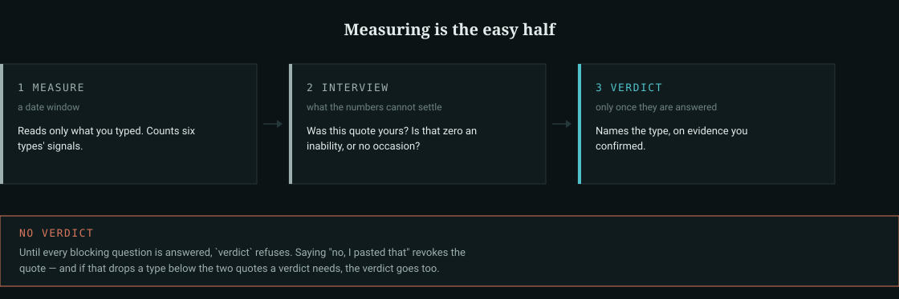
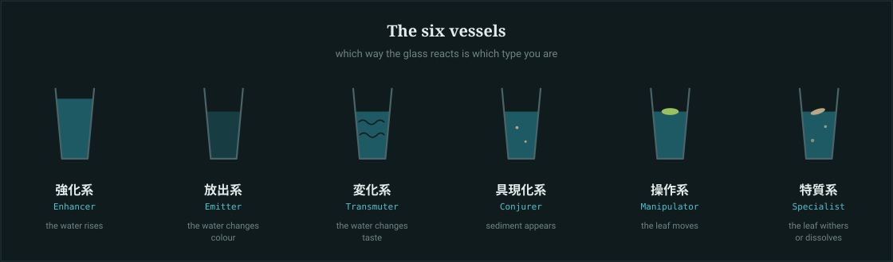
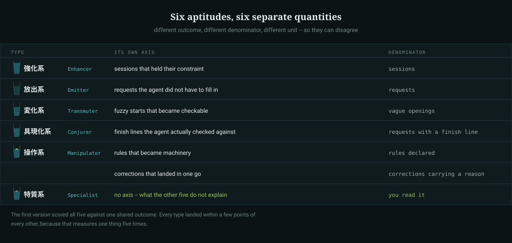

# agent-water-divination

[](https://github.com/kai-chop/agent-water-divination/actions/workflows/test.yml)

**You have a year of evidence about how you direct an AI, and you have never read it.** Model
evaluations are everywhere; the other half of the pair — the person writing the instructions — is
measured by nobody. This reads your own past messages back to you and names which of six aptitudes
they actually show.

> 🇯🇵 **日本語**: [README.ja.md](README.ja.md)

```
python tools/water_divination.py measure --since 2026-08-01
```

That is the whole entry point. It finds your transcripts, keeps only the messages you typed inside
that window, counts the six types' signals, and then — this is the part that matters — prints what
it could **not** settle, as questions to answer out loud.



## Where the six come from

The Water Divination is the aptitude test from Yoshihiro Togashi's *HUNTER × HUNTER*: you fill a
glass with water, float a leaf on it, and wrap the glass in your aura. Which of six ways the glass
reacts tells you your type. The six are borrowed straight from there and re-read as aptitudes of
the person directing an AI — the glass is a month of your own messages, and the reactions keep
their original meanings.

| Type | The glass | Re-read as |
|---|---|---|
| 強化系 Enhancer | the water rises | Holding the goal and its constraints all the way through |
| 放出系 Emitter | the water changes colour | Getting the finished picture out of your head and into the agent |
| 変化系 Transmuter | the water changes taste | Turning a feeling, or another field's structure, into this one's |
| 具現化系 Conjurer | sediment appears | Turning a vague ideal into a spec and a finish line |
| 操作系 Manipulator | the leaf moves | Steering the agent's rules, not just fixing its output |
| 特質系 Specialist | the leaf withers | Something the other five cannot account for |

Note the odd one out: five of the reactions happen to the water, and the sixth happens to the
leaf. That asymmetry is why Specialist is measured differently here — see below.



This repo is not affiliated with, endorsed by, or licensed from the rights holders of
*HUNTER × HUNTER*. Only the six-way framing is borrowed, as a reading of a published work.

## The measuring is the easy half

A regex can tell you that you wrote "from now on" six times. It cannot tell you:

- whether a 900-character message was **your** writing or another model's output you pasted in
- whether a signal at **zero** means you can't do that, or that nothing this month called for it
- whether the quote it found means what it appears to mean, out of context

So the tool doesn't pretend. `measure` ends with an interview — one question per unsettled thing —
and `verdict` **refuses to conclude** while a blocking question is unanswered:

```
NO VERDICT. The reading stays provisional because:
  - blocking questions unanswered: auth_kyouka_20260820T1632
  - sousa has 1 quote(s) left after revocations, needs 2 or a passing probe
```

Answering *"no, I pasted that"* revokes the quote. If that drops a type below the two quotes a
verdict requires, the verdict goes with it. The interview is a gate, not a formality.

## Six aptitudes need six separate quantities

Counting your vocabulary tells you that you *exercised* an aptitude, never that it *worked*. So
each type carries a second number: what happened next, on the agent's side. Each one has its own
outcome, its own denominator and its own unit, so they can move independently.

| Type | Its own axis | Denominator |
|---|---|---|
| Enhancer | sessions that held their constraint to the end without a correction | sessions |
| Emitter | requests the agent could act on, instead of asking what you meant | requests |
| Transmuter | fuzzy starts that turned into something checkable | vague openings |
| Conjurer | finish lines the agent actually came back with evidence against | requests with a finish line |
| Manipulator | rules that reached a rule file, hook or config | rules declared |
| Specialist | not a rate — see below | — |



The first version of this layer did it the obvious way: one outcome for everybody, and split the
population by which vocabulary a request carried. Every type then landed within a few points of
every other, all pointing the same direction, because that design measures one thing five times —
longer requests carry more of every vocabulary and are harder. Adjusting for length would have
hidden a structural fault behind a statistic. **If your six axes cannot disagree with each other,
you do not have six axes.**

## Specialist is a find, not a score

Five reactions happen to the water; the sixth happens to the leaf. Specialist is measured
differently for the same reason: as a **catalogue of rare events**, each needing three or four
things to line up in order and close together.

- **A lesson that became machinery** — a correction, then a rule, then that rule written into a
  file, hook or config, all in one stretch. The failure stopped depending on anyone remembering it.
- **A feeling turned into a check** — "something's off", then a criterion someone else could
  apply, then the agent verifying against it.
- **Separate sources woven into one thing** — material brought in from elsewhere, your own
  instruction beside it, and something durable written out of the combination.
- **Asking to be proven wrong before starting** — you invited the counter-example while it was
  still cheap.

Most windows turn up none, and that is the expected result. Rare here means **rare by
construction** — the definitions are hard to satisfy — not rare compared with other people. There
is no cross-operator baseline in this repo, and inventing one would be a fabrication.

## What it found in the corpus it was built on

One real corpus, 2026-07-27 → 2026-09-01, Claude Code and Codex transcripts, 505 extracted
messages. Three findings shaped the tool:

**24 of 505 "user messages" (4.8%) were another AI's text, pasted in.** Small share, large effect:
those pastes are dense in correction words, so the operator's one-shot correction rate read
**26.9% (7/26)** with them and **100% (6/6)** without. Reporting the first number would have
described a collapse that never happened. Every cross-cutting metric is therefore printed twice —
over everything extracted, and over your words only.

**A type read 0, and 0 was wrong.** Emitter's "finished picture" signal came back empty while a
quote sitting in another type was a finished picture, in detail. The vocabulary was looking for the
word *completion* and the operator had written *I want it to end up like…*. Widening the pattern
moved it 0 → 3. The lesson is in the other direction too: a second pattern stayed at 0 after the
same widening, and it is **still shipped as 0**, because widening it until it matched quotes already
chosen would be fitting the instrument to the answer.

**The instrument's author is in the verdict.** The pattern words for "steering" were chosen by an
agent that had just read that operator's own rules — and steering came out as the main type. That
is not proof it was wrong, but a reading that doesn't say this out loud is hiding its largest
source of error. The skill requires a one-line bias declaration in every reading, and a second
opinion when the main type changes.

## Install

No dependencies. CI runs the self-tests on Python 3.9 and 3.12, across Linux, Windows and macOS.

```bash
git clone https://github.com/kai-chop/agent-water-divination
cd agent-water-divination
python tools/water_divination.py measure --since 2026-01-01 --config examples/demo.json --out out
```

That runs against an invented corpus in `examples/`, so you can see the whole flow before pointing
it at yourself. For your own transcripts, `cp water-divination.example.json water-divination.json`,
edit the roots, and drop `--config`.

Windows accepted by `measure`: `--since` / `--until` (date, or `2026-08-01T14:00` to the minute),
`--on` for one day, `--last 30d` (also `12h`, `8w`).

## Where it reads from

| `format` | Store | Status |
|---|---|---|
| `claude-code` | `~/.claude/projects/*/*.jsonl` | verified against a real store |
| `codex` | `~/.codex/sessions/**/*.jsonl` | verified against a real store (101 files) |
| `chatgpt-export` | `conversations.json` from a data export | written to the documented shape, fixture-covered, **not yet run against a real export** |
| `jsonl` | your own: one object per line, `text` required | generic escape hatch |
| `text` | `.txt`, one utterance per blank-line block | no timestamps, so date windows can't apply |

A store you don't have is skipped silently — nobody has all of them — but the scan report always
prints `read N, kept M` per source, so "configured" is never mistaken for "ran". Adding a format is
about twenty lines in `tools/nen_corpus.py`.

## ⚠ Measured limits

- **English patterns have measured specificity, unmeasured sensitivity.** The Japanese set was
  checked against a real 505-message corpus. `patterns/en.json` was written by translating its
  intent, and no English corpus of operator instructions has been run through it — so whether it
  *catches* what it names is still unknown. What can be checked without such a corpus is the other
  half: whether a pattern fires on writing nobody aimed at an agent.

  ```
  python tools/nen_signals.py --audit-patterns .
  ```

  Point it at any prose you have. Over this repo's own 150 paragraphs of documentation, the
  loosest real pattern is English `constraint` at **6.0%** (documentation is unusually full of
  "must" and "never"), then `attribution` at 4.7% and `verify` at 4.0%; everything else sits at
  or below 3.3%. `concrete` matches 79.3% and is meant to — it exists to notice that a message
  contains *any* identifier or number, and is used as a negative guard.

  Treat English counts as weaker evidence than Japanese ones until someone measures the
  sensitivity half.
- **Pasted plain prose still gets through.** Detection catches long text carrying markdown
  structure, or long text that names its source in its first characters. An agent's plain-prose
  answer pasted with no attribution is still counted as yours. This is why the interview asks about
  every long quote rather than trusting the classifier.
- **`short_chars` and `paste_min_chars` are tuned for Japanese**, which carries roughly twice the
  meaning per character. English corpora want about double both.
- **It reads text, not outcomes.** It measures how you write to an agent. Whether the work was any
  good is not in the corpus.

## Layout

```
tools/water_divination.py   measure → interview → verdict (the entry point)
tools/nen_corpus.py         finding transcripts, keeping only what you typed, spotting pastes
tools/nen_signals.py        the six types' counts, and generating the open questions
tools/nen_context.py        pulling a quote back out of the transcript with its context
tools/nen_report.py         one self-contained HTML page, no network, both themes
tools/nen_assets.py         the diagrams above, generated from patterns/*.json
patterns/*.json             the six definitions, the regexes, and the probe questions
skill/{en,ja}/SKILL.md      the judging discipline, for an agent to follow
assets/                     diagrams (SVG) and the social preview card (PNG), committed
```

Nothing in `assets/` is drawn by hand. Rename a type or add a language in `patterns/*.json`, run
`python tools/nen_assets.py` (`--lang ja` for the Japanese set, `--png` to redraw the card if you
have Pillow), and the pictures agree with the code again. The vessel geometry is imported from the
report renderer, so the diagram in this README and the one in your own reading are the same drawing.

GitHub cannot take an SVG in the social preview slot, so `assets/social-preview.png` is committed
ready to use. There is no API for that setting — attach it once under
**Settings → General → Social preview**.

`skill/` is written for an AI agent to run the reading conversationally — the interview works far
better spoken than filled into a JSON file by hand. Copy the directory into whatever your agent
loads skills from.

## Licence

MIT. See [LICENSE](LICENSE).
